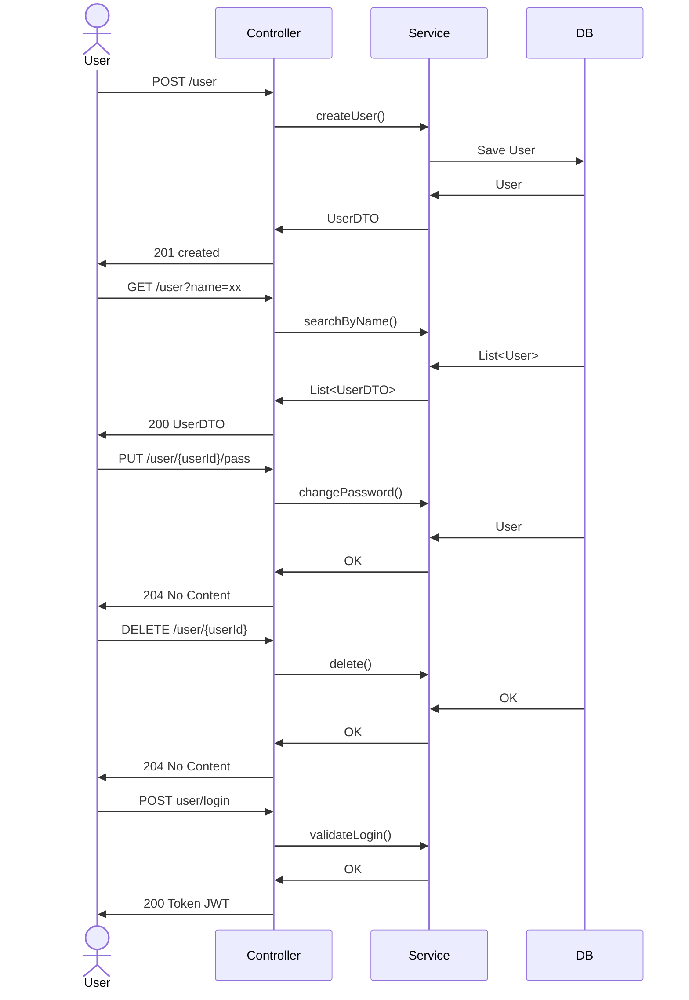

# Introdução

## Descrição

## Objetivo do projeto

# Arquitetura do Sistema

## Descrição da Arquitetura

## Diagrama da Arquitetura

# Descrição dos Endpoints da API

## Tabela de Endpoints

## Exemplos de requisição e resposta

# Configuração do Projeto

## Configuração do Docker Compose

## Instruções para execução local

# Qualidade do Código

## Boas Práticas Utilizadas

# Collections para Teste

## Link para a Collection do Postman

## Descrição dos Testes Manuais

# Repositório do Código

## URL do Repositório

