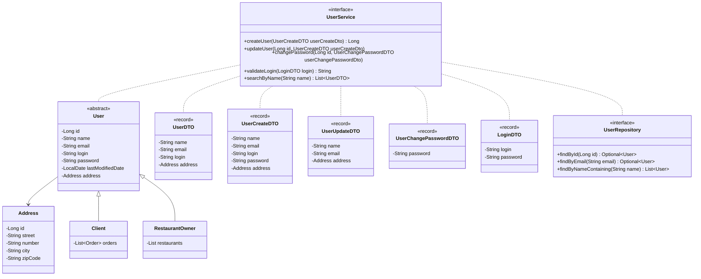
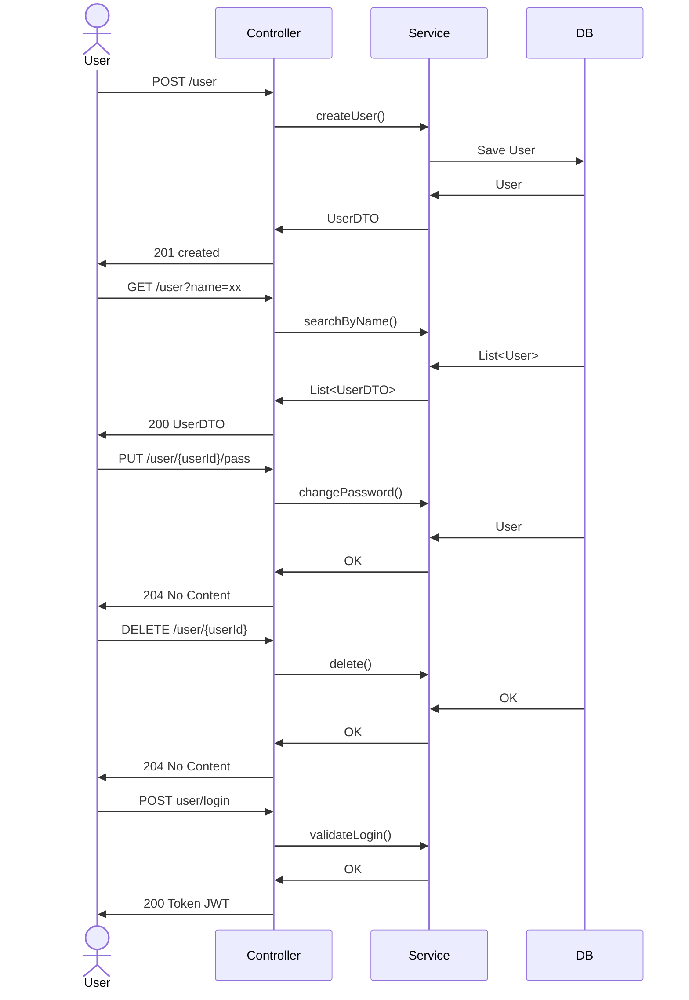

# Introdução
## Descrição
Este projeto consiste no desenvolvimento de uma API backend para gestão de usuários de uma plataforma compartilhada entre restaurantes, permitindo o cadastro e manutenção de diferentes tipos de usuários, como donos de restaurante e clientes.

O sistema foi desenvolvido como parte do **Tech Challenge – Fase 1** do programa de **Pós-Graduação em Arquitetura e Desenvolvimento Java (FIAP)**, com foco na aplicação prática dos conceitos estudados ao longo do curso.

A aplicação foi desenvolvida utilizando **Spring Boot**, com ênfase em boas práticas de arquitetura, segurança, organização de código e padronização de **APIs REST**, atendendo integralmente aos requisitos definidos no desafio proposto.


## Objetivo do Projeto

Desenvolver um backend completo e robusto aplicando os conceitos aprendidos na Fase 1 do curso, incluindo:
- Cadastro, atualização e exclusão de usuários
- Separação de endpoints sensíveis (troca de senha)
- Validação de login e senha
- Garantia de unicidade de e-mail e login
- Registro da data da última alteração do usuário
- Busca de usuários pelo nome
- Versionamento da API
- Padronização de erros utilizando Problem Details (RFC 7807)
- Autenticação baseada em JWT
- Execução em ambiente containerizado com Docker Compose e banco de dados relacional (PostgreSQL)

# Arquitetura do Sistema
## Descrição da Arquitetura

A aplicação adota o padrão de **Arquitetura Hexagonal (Ports and Adapters)**, promovendo uma separação clara entre as responsabilidades do sistema:
- **Domínio:** regras de negócio e entidades;
- **Aplicação:** casos de uso e serviços;
- **Infraestrutura:** controllers REST, persistência de dados e configurações externas.

A comunicação entre as camadas ocorre por meio de **interfaces (ports)**, garantindo baixo acoplamento, maior testabilidade e facilidade de manutenção.

A segurança da aplicação é implementada com **Spring Security** e **JWT**, restringindo o acesso aos endpoints conforme o usuário autenticado.

## Diagrama da Arquitetura





# API – Endpoints

Esta seção descreve os endpoints disponíveis na API, incluindo métodos HTTP, URLs, necessidade de autenticação e exemplos de requisição e resposta.

## Tabela de Endpoints
### 🔐 Autenticação

| Método | Endpoint   | Autenticação | Descrição |
|------|-----------|--------------|-----------|
| POST | `/v1/auth` | ❌ Não       | Autentica o usuário e retorna um token JWT |

---

### 👤 Usuários

| Método | Endpoint                     | Autenticação | Descrição |
|------|------------------------------|--------------|-----------|
| GET  | `/v1/user`                   | ❌ Não       | Lista usuários ou filtra por nome (`?name=`) |
| GET  | `/v1/user/{login}`           | ✅ Sim       | Retorna os dados do usuário pelo login |
| POST | `/v1/user`                   | ❌ Não       | Cria um novo usuário |
| PUT  | `/v1/user/{login}`           | ✅ Sim       | Atualiza os dados do usuário (exceto senha) |
| PUT  | `/v1/user/password/{login}`  | ✅ Sim       | Atualiza a senha do usuário |
| DELETE | `/v1/user/{login}`         | ✅ Sim       | Remove o usuário |

---

## Exemplos de Requisição e Resposta
### 🔐 Autenticação

#### POST `/v1/auth`

**Requisição**
```json
{
  "login": "joao.silva",
  "password": "senha123"
}
```
**Resposta - 200 OK**
```json
{
  "token": "eyJhbGciOiJIUzI1NiIsInR5cCI6IkpXVCJ9...",
  "login": "Bearer",
  "expiresIn": 3600000
}
```

### 👤 Usuários
#### POST `/v1/user`

**Requisição**
```json
{
	"name":"Joao Silva Santos",
	"email": "joaosilva.santos@email.com",
	"login": "joaosilva.santos",
  	"password": "senha12345*",
  	"userTypeDTO": "CLIENT",
	"address": {
		"street":"Rua das Flores",
		"number":123,
		"neighborhood": "Centro",
		"city": "São Paulo",
		"state": "SP",
		"zipCode": "01234567"
	}
}
```
**Resposta - 201 CREATED**
```json
{
  "name": "Joao Silva Santos",
  "login": "joaosilva.santos"
}
```
#### GET `/v1/user/{login}`
🔒**Requer autenticação (Bearer Token)**

**Resposta – 200 OK**
```json
{
	"name": "Joao Silva Santos",
	"email": "joaosilva.santos@email.com",
	"login": "joaosilva.santos",
	"address": {
		"street":"Rua das Flores",
		"number":123,
		"neighborhood": "Centro",
		"city": "São Paulo",
		"state": "SP",
		"zipCode": "01234567"
	}
}
```

A documentação completa e interativa da API está disponível via **Swagger UI** após subir a aplicação.

# Configuração e Execução
## Docker Compose

A aplicação é executada utilizando **Docker Compose**, que orquestra os seguintes serviços:
- API Spring Boot
- Banco de dados PostgreSQL

O serviço da aplicação utiliza um **Dockerfile com multi-stage build**, onde:
- A primeira etapa compila o projeto com Maven e Amazon Corretto 21;
- A etapa final utiliza uma imagem leve (`amazoncorretto:21-alpine`) apenas para execução do JAR, reduzindo o tamanho final da imagem e aumentando a segurança.

O banco de dados PostgreSQL roda em container separado, com persistência garantida por meio de volumes Docker.

### Execução local
Para iniciar a aplicação, execute:

`docker-compose -f docker/docker-compose.yml up`

Esse comando inicializa toda a aplicação, incluindo API e banco de dados, sem necessidade de configurações adicionais no ambiente local.

# Qualidade do Código e Boas Praticas
O projeto aplica boas práticas de desenvolvimento backend, incluindo:
- Princípios SOLID
- Arquitetura Hexagonal
- Separação clara de responsabilidades
- Validação de dados com **Spring Validation**
- Controle transacional com `@Transactional`
- Criptografia de senhas com `PasswordEncoder`
- Autenticação e autorização com **JWT**
- Versionamento de banco de dados com **Flyway**
- Documentação automática com **Swagger/OpenAPI**

As regras de negócio críticas são tratadas por exceções específicas, resultando em respostas padronizadas conforme o **RFC 7807**.

# Testes
## Collection do Postman
O repositório contém uma collection do Postman e um environment prontos para importação, cobrindo os principais cenários exigidos no desafio, incluindo:
- Cadastro de usuário válido e inválido (ex.: e-mail duplicado);
- Atualização de senha (endpoint exclusivo);
- Atualização de dados do usuário;
- Busca de usuários pelo nome;
- Validação de login.

Para executar os testes, basta importar os arquivos disponíveis no repositório no Postman

# Repositório do Código
[https://github.com/lucaso-silva/tech-challenge-i](https://github.com/lucaso-silva/tech-challenge-i)

# Integrantes: 
- [Hugo Soares](https://github.com/HugoOliveiraSoares) 
- [Lucas Oliveira](https://github.com/lucaso-silva) 
- [Matheus Sousa](https://github.com/msousa-s)
