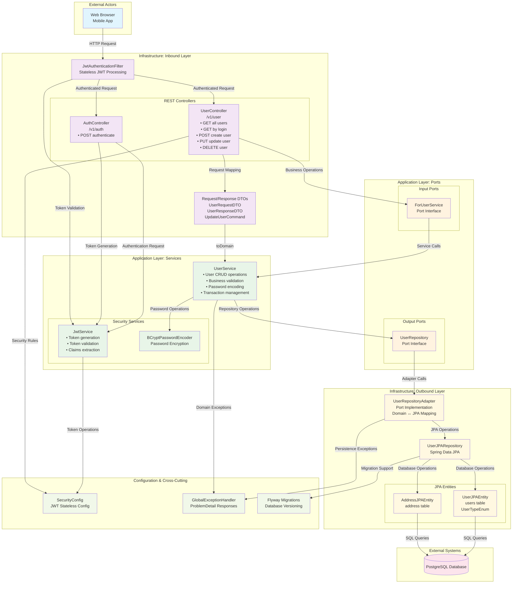
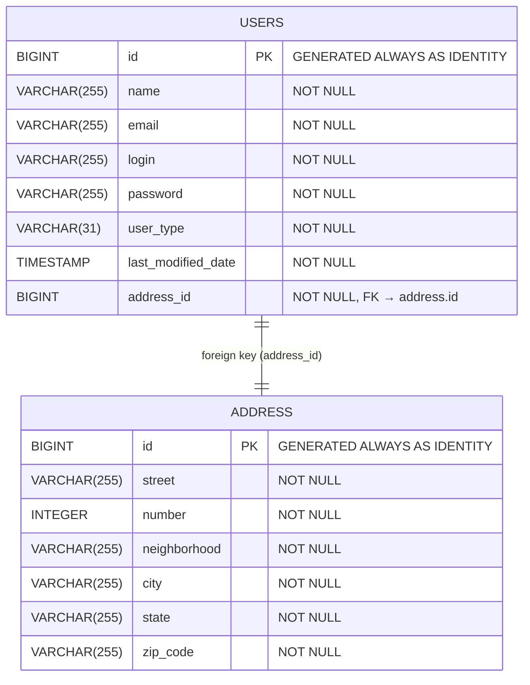

# Introdução
## Descrição
Este projeto consiste no desenvolvimento de uma API backend para gestão de usuários de uma plataforma compartilhada entre restaurantes, permitindo o cadastro e manutenção de diferentes tipos de usuários, como donos de restaurante e clientes.

O sistema foi desenvolvido como parte do **Tech Challenge – Fase 1** do programa de **Pós-Graduação em Arquitetura e Desenvolvimento Java (FIAP)**, com foco na aplicação prática dos conceitos estudados ao longo do curso.

A aplicação foi desenvolvida utilizando **Spring Boot**, com ênfase em boas práticas de arquitetura, segurança, organização de código e padronização de **APIs REST**, atendendo integralmente aos requisitos definidos no desafio proposto.


## Objetivo do Projeto

Desenvolver um backend completo e robusto aplicando os conceitos aprendidos na Fase 1 do curso, incluindo:
- Cadastro, atualização e exclusão de usuários
- Separação de endpoints sensíveis (troca de senha)
- Validação de login e senha
- Garantia de unicidade de e-mail e login
- Registro da data da última alteração do usuário
- Busca de usuários pelo nome
- Versionamento da API
- Padronização de erros utilizando Problem Details (RFC 7807)
- Autenticação baseada em JWT
- Execução em ambiente containerizado com Docker Compose e banco de dados relacional (PostgreSQL)

# Arquitetura do Sistema
## Descrição da Arquitetura

A aplicação adota o padrão de **Arquitetura Hexagonal (Ports and Adapters)**, promovendo uma separação clara entre as responsabilidades do sistema:
- **Domínio:** regras de negócio e entidades;
- **Aplicação:** casos de uso e serviços;
- **Infraestrutura:** controllers REST, persistência de dados e configurações externas.

A comunicação entre as camadas ocorre por meio de **interfaces (ports)**, garantindo baixo acoplamento, maior testabilidade e facilidade de manutenção.

A segurança da aplicação é implementada com **Spring Security** e **JWT**, restringindo o acesso aos endpoints conforme o usuário autenticado.

## Diagrama da Arquitetura


```mermaid
graph TB
    %% External Actors
    subgraph "External Actors"
        WEB[Web Browser<br/>Mobile App]
    end

    %% Infrastructure Inbound Layer
    subgraph "Infrastructure: Inbound Layer"
        direction LR
        JWT_FILTER[JwtAuthenticationFilter<br/>Stateless JWT Processing]
        
        subgraph "REST Controllers"
            USER_CONTROLLER[UserController<br/>/v1/user<br/>• GET all users<br/>• GET by login<br/>• POST create user<br/>• PUT update user<br/>• DELETE user]
            AUTH_CONTROLLER[AuthController<br/>/v1/auth<br/>• POST authenticate]
        end
        
        DTO[Request/Response DTOs<br/>UserRequestDTO<br/>UserResponseDTO<br/>UpdateUserCommand]
    end

    %% Application Layer (Ports)
    subgraph "Application Layer: Ports"
        direction LR
        subgraph "Input Ports"
            FOR_USER_SERVICE[ForUserService<br/>Port Interface]
        end
        
        subgraph "Output Ports"
            USER_REPOSITORY_PORT[UserRepository<br/>Port Interface]
        end
    end

    %% Application Layer: Core Business Logic
    subgraph "Application Layer: Services"
        direction TB
        USER_SERVICE[UserService<br/>• User CRUD operations<br/>• Business validation<br/>• Password encoding<br/>• Transaction management]
        
        subgraph "Security Services"
            JWT_SERVICE[JwtService<br/>• Token generation<br/>• Token validation<br/>• Claims extraction]
            PWD_ENCODER[BCryptPasswordEncoder<br/>Password Encryption]
        end
    end

    %% Infrastructure Outbound Layer
    subgraph "Infrastructure: Outbound Layer"
        direction LR
        REPO_ADAPTER[UserRepositoryAdapter<br/>Port Implementation<br/>Domain ↔ JPA Mapping]
        
        subgraph "JPA Entities"
            USER_JPA[UserJPAEntity<br/>users table<br/>UserTypeEnum]
            ADDRESS_JPA[AddressJPAEntity<br/>address table]
        end
        
        JPA_REPO[UserJPARepository<br/>Spring Data JPA]
    end

    %% External Systems
    subgraph "External Systems"
        POSTGRES[(PostgreSQL Database)]
    end

    %% Configuration and Exception Handling
    subgraph "Configuration & Cross-Cutting"
        SECURITY_CONFIG[SecurityConfig<br/>JWT Stateless Config]
        GLOBAL_HANDLER[GlobalExceptionHandler<br/>ProblemDetail Responses]
        FLYWAY[Flyway Migrations<br/>Database Versioning]
    end

    %% Connections - Request Flow
    WEB -->|HTTP Request| JWT_FILTER
    JWT_FILTER -->|Authenticated Request| AUTH_CONTROLLER
    JWT_FILTER -->|Authenticated Request| USER_CONTROLLER
    AUTH_CONTROLLER -->|Authentication Request| JWT_SERVICE
    USER_CONTROLLER -->|Business Operations| FOR_USER_SERVICE
    AUTH_CONTROLLER -->|Token Generation| JWT_SERVICE
    FOR_USER_SERVICE -->|Service Calls| USER_SERVICE
    USER_SERVICE -->|Repository Operations| USER_REPOSITORY_PORT
    USER_REPOSITORY_PORT -->|Adapter Calls| REPO_ADAPTER
    REPO_ADAPTER -->|JPA Operations| JPA_REPO
    JPA_REPO -->|Database Operations| USER_JPA
    JPA_REPO -->|Database Operations| ADDRESS_JPA
    USER_JPA -->|SQL Queries| POSTGRES
    ADDRESS_JPA -->|SQL Queries| POSTGRES

    %% Security Flow
    USER_SERVICE -->|Password Operations| PWD_ENCODER
    JWT_FILTER -->|Token Validation| JWT_SERVICE
    JWT_SERVICE -->|Token Operations| SECURITY_CONFIG

    %% DTO Mapping
    USER_CONTROLLER -->|Request Mapping| DTO
    DTO -->|toDomain| USER_SERVICE

    %% Exception Handling
    USER_SERVICE -->|Domain Exceptions| GLOBAL_HANDLER
    REPO_ADAPTER -->|Persistence Exceptions| GLOBAL_HANDLER

    %% Configuration
    USER_CONTROLLER -->|Security Rules| SECURITY_CONFIG
    JPA_REPO -->|Migration Support| FLYWAY

    %% Styling
    classDef external fill:#e1f5fe
    classDef inbound fill:#f3e5f5
    classDef ports fill:#fff3e0
    classDef services fill:#e8f5e8
    classDef outbound fill:#fff8e1
    classDef database fill:#fce4ec
    classDef config fill:#f1f8e9

    class WEB external
    class JWT_FILTER,USER_CONTROLLER,AUTH_CONTROLLER,DTO inbound
    class FOR_USER_SERVICE,USER_REPOSITORY_PORT ports
    class USER_SERVICE,JWT_SERVICE,PWD_ENCODER services
    class REPO_ADAPTER,USER_JPA,ADDRESS_JPA,JPA_REPO outbound
    class POSTGRES database
    class SECURITY_CONFIG,GLOBAL_HANDLER,FLYWAY config
```


```mermaid
erDiagram
    USERS {
        BIGINT id PK "GENERATED ALWAYS AS IDENTITY"
        VARCHAR(255) name "NOT NULL"
        VARCHAR(255) email "NOT NULL"
        VARCHAR(255) login "NOT NULL"
        VARCHAR(255) password "NOT NULL"
        VARCHAR(31) user_type "NOT NULL"
        TIMESTAMP last_modified_date "NOT NULL"
        BIGINT address_id "NOT NULL, FK → address.id"
    }

    ADDRESS {
        BIGINT id PK "GENERATED ALWAYS AS IDENTITY"
        VARCHAR(255) street "NOT NULL"
        INTEGER number "NOT NULL"
        VARCHAR(255) neighborhood "NOT NULL"
        VARCHAR(255) city "NOT NULL"
        VARCHAR(255) state "NOT NULL"
        VARCHAR(255) zip_code "NOT NULL"
    }

    %% Relationships
    USERS ||--|| ADDRESS : "foreign key (address_id)"
```

# API – Endpoints

Esta seção descreve os endpoints disponíveis na API, incluindo métodos HTTP, URLs, necessidade de autenticação e exemplos de requisição e resposta.

## Tabela de Endpoints
### 🔐 Autenticação

| Método | Endpoint   | Autenticação | Descrição |
|------|-----------|--------------|-----------|
| POST | `/v1/auth` | ❌ Não       | Autentica o usuário e retorna um token JWT |

---

### 👤 Usuários

| Método | Endpoint                     | Autenticação | Descrição |
|------|------------------------------|--------------|-----------|
| GET  | `/v1/user`                   | ❌ Não       | Lista usuários ou filtra por nome (`?name=`) |
| GET  | `/v1/user/{login}`           | ✅ Sim       | Retorna os dados do usuário pelo login |
| POST | `/v1/user`                   | ❌ Não       | Cria um novo usuário |
| PUT  | `/v1/user/{login}`           | ✅ Sim       | Atualiza os dados do usuário (exceto senha) |
| PUT  | `/v1/user/password/{login}`  | ✅ Sim       | Atualiza a senha do usuário |
| DELETE | `/v1/user/{login}`         | ✅ Sim       | Remove o usuário |

---

## Exemplos de Requisição e Resposta
### 🔐 Autenticação

#### POST `/v1/auth`

**Requisição**
```json
{
  "login": "joao.silva",
  "password": "senha123"
}
```
**Resposta - 200 OK**
```json
{
  "token": "eyJhbGciOiJIUzI1NiIsInR5cCI6IkpXVCJ9...",
  "login": "Bearer",
  "expiresIn": 3600000
}
```

### 👤 Usuários
#### POST `/v1/user`

**Requisição**
```json
{
	"name":"Joao Silva Santos",
	"email": "joaosilva.santos@email.com",
	"login": "joaosilva.santos",
  	"password": "senha12345*",
  	"userTypeDTO": "CLIENT",
	"address": {
		"street":"Rua das Flores",
		"number":123,
		"neighborhood": "Centro",
		"city": "São Paulo",
		"state": "SP",
		"zipCode": "01234567"
	}
}
```
**Resposta - 201 CREATED**
```json
{
  "name": "Joao Silva Santos",
  "login": "joaosilva.santos"
}
```
#### GET `/v1/user/{login}`
🔒**Requer autenticação (Bearer Token)**

**Resposta – 200 OK**
```json
{
	"name": "Joao Silva Santos",
	"email": "joaosilva.santos@email.com",
	"login": "joaosilva.santos",
	"address": {
		"street":"Rua das Flores",
		"number":123,
		"neighborhood": "Centro",
		"city": "São Paulo",
		"state": "SP",
		"zipCode": "01234567"
	}
}
```

A documentação completa e interativa da API está disponível via **Swagger UI** após subir a aplicação.

# Configuração e Execução
## Docker Compose

A aplicação é executada utilizando **Docker Compose**, que orquestra os seguintes serviços:
- API Spring Boot
- Banco de dados PostgreSQL

O serviço da aplicação utiliza um **Dockerfile com multi-stage build**, onde:
- A primeira etapa compila o projeto com Maven e Amazon Corretto 21;
- A etapa final utiliza uma imagem leve (`amazoncorretto:21-alpine`) apenas para execução do JAR, reduzindo o tamanho final da imagem e aumentando a segurança.

O banco de dados PostgreSQL roda em container separado, com persistência garantida por meio de volumes Docker.

### Execução local
Para iniciar a aplicação, execute:

`docker-compose -f docker/docker-compose.yml up`

Esse comando inicializa toda a aplicação, incluindo API e banco de dados, sem necessidade de configurações adicionais no ambiente local.

# Qualidade do Código e Boas Praticas
O projeto aplica boas práticas de desenvolvimento backend, incluindo:
- Princípios SOLID
- Arquitetura Hexagonal
- Separação clara de responsabilidades
- Validação de dados com **Spring Validation**
- Controle transacional com `@Transactional`
- Criptografia de senhas com `PasswordEncoder`
- Autenticação e autorização com **JWT**
- Versionamento de banco de dados com **Flyway**
- Documentação automática com **Swagger/OpenAPI**

As regras de negócio críticas são tratadas por exceções específicas, resultando em respostas padronizadas conforme o **RFC 7807**.

# Testes
## Collection do Postman
O repositório contém uma collection do Postman e um environment prontos para importação, cobrindo os principais cenários exigidos no desafio, incluindo:
- Cadastro de usuário válido e inválido (ex.: e-mail duplicado);
- Atualização de senha (endpoint exclusivo);
- Atualização de dados do usuário;
- Busca de usuários pelo nome;
- Validação de login.

Para executar os testes, basta importar os arquivos disponíveis no repositório no Postman

# Repositório do Código
[https://github.com/lucaso-silva/tech-challenge-i](https://github.com/lucaso-silva/tech-challenge-i)

# Integrantes: 
- [Hugo Soares](https://github.com/HugoOliveiraSoares) 
- [Lucas Oliveira](https://github.com/lucaso-silva) 
- [Matheus Sousa](https://github.com/msousa-s)
